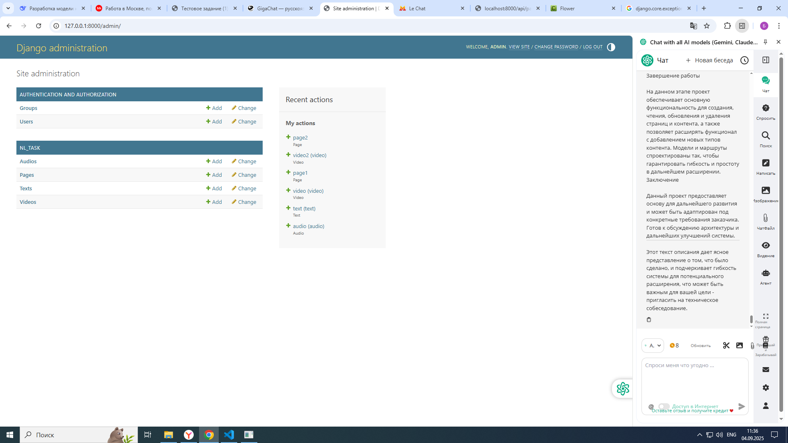
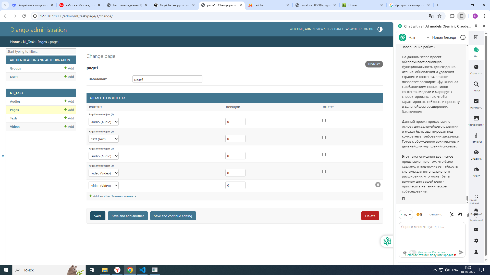
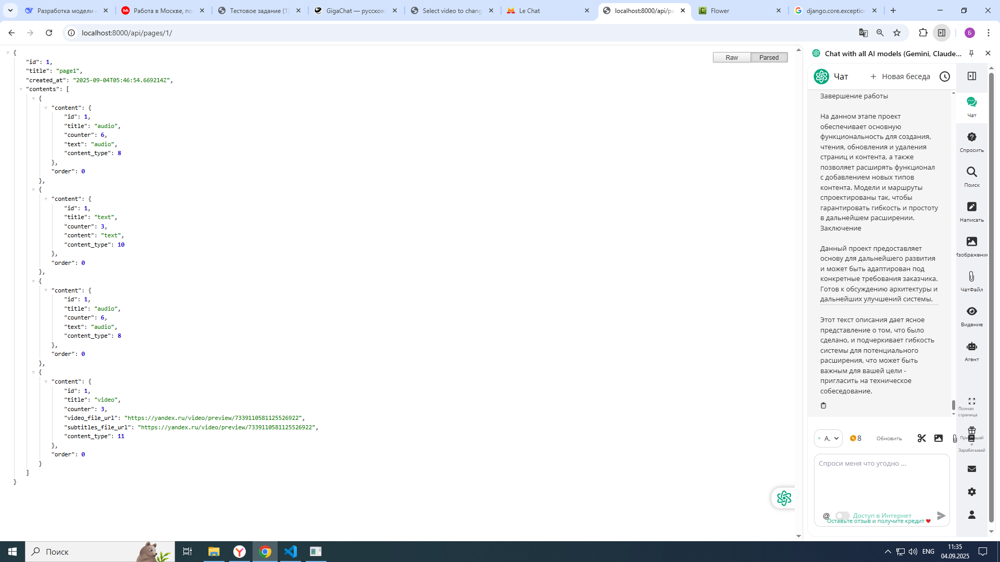
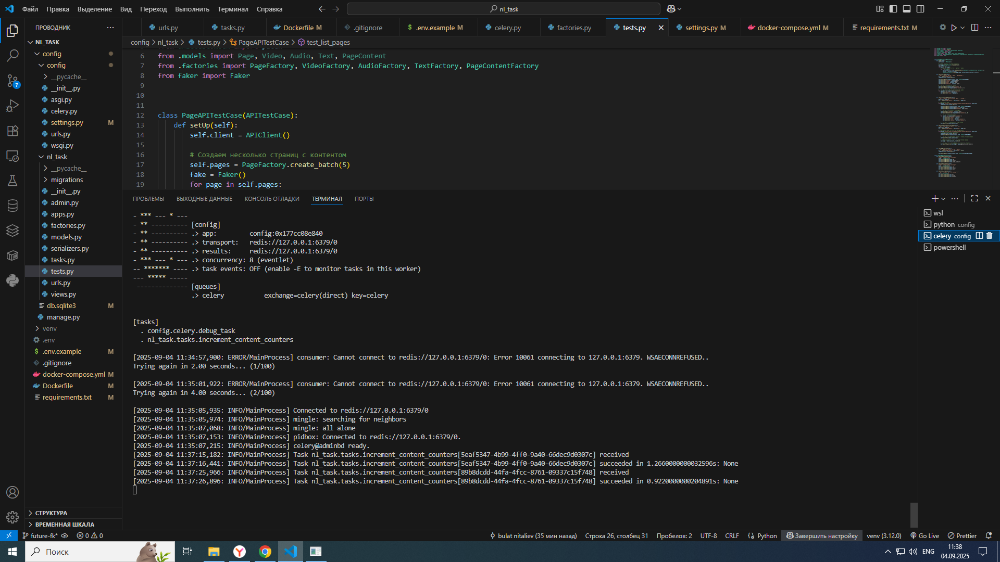
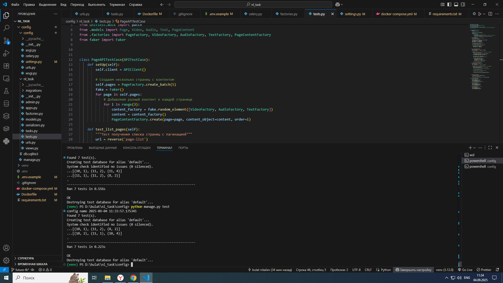

# Content Pages Management System
Система управления страницами с различными типами контента (видео, аудио, текст) с использованием Django REST Framework и Celery для фоновых задач.

## Технологический стек
Backend: Python 3.9+, Django 4.0+

API: Django REST Framework

База данных: MySQL 8.0+

Очереди задач: Celery с RabbitMQ в качестве брокера

Кэширование: Redis

Аутентификация: Стандартная Django (расширяемая до JWT)

Функциональные возможности
### API Endpoints
GET /api/pages/ - Получение списка страниц с пагинацией

GET /api/pages/{id}/ - Получение детальной информации о странице с вложенным контентом

### Админ-панель
Управление страницами и контентом через интуитивный интерфейс

Поиск по заголовкам страниц и контента

Inline-привязка контента к страницам с управлением порядком

### Фоновые задачи
Атомарное увеличение счетчиков просмотров через Celery

Обеспечение консистентности данных при высокой нагрузке

### Установка и запуск
Предварительные требования
Python 3.9+

MySQL 8.0+

Redis

RabbitMQ

### Шаги установки
Клонирование репозитория

```
git clone https://github.com/bulat-nitaliev/nl_task.git
cd nl_task
```
Создание виртуального окружения

```
python -m venv venv
source venv/bin/activate  # Linux/MacOS
# или
venv\Scripts\activate     # Windows
```

Установка зависимостей

```
pip install -r requirements.txt
```
Настройка базы данных


```
python manage.py migrate
```
Создание суперпользователя
```
python manage.py createsuperuser
```
Запуск сервера разработки

```
python manage.py runserver
```
Запуск Celery worker

```
celery -A config worker --loglevel=info
Запуск Celery beat (если нужны периодические задачи)
```

### Использование API
Получение списка страниц
```
curl -X GET http://localhost:8000/api/pages/
```
Ответ:
```
json
{
  "count": 10,
  "next": "http://localhost:8000/api/pages/?page=2",
  "previous": null,
  "results": [
    {
      "id": 1,
      "title": "Главная страница",
      "url": "http://localhost:8000/api/pages/1/",
      "created_at": "2023-01-01T12:00:00Z"
    }
  ]
}
```
Получение детальной информации о странице
```
curl -X GET http://localhost:8000/api/pages/1/
```
Ответ:
```
json
{
  "id": 1,
  "title": "Главная страница",
  "created_at": "2023-01-01T12:00:00Z",
  "updated_at": "2023-01-01T12:00:00Z",
  "content": [
    {
      "content_object": {
        "id": 1,
        "title": "Демо видео",
        "counter": 42,
        "video_file_url": "https://example.com/video.mp4",
        "subtitles_file_url": "https://example.com/subs.vtt"
      },
      "order": 0
    },
    {
      "content_object": {
        "id": 2,
        "title": "Приветственный текст",
        "counter": 42,
        "content": "Добро пожаловать на наш сайт..."
      },
      "order": 1
    }
  ]
}
```
Запуск тестов
Для запуска тестов выполните команду:

```
python manage.py test
```

 
 
 
 
 